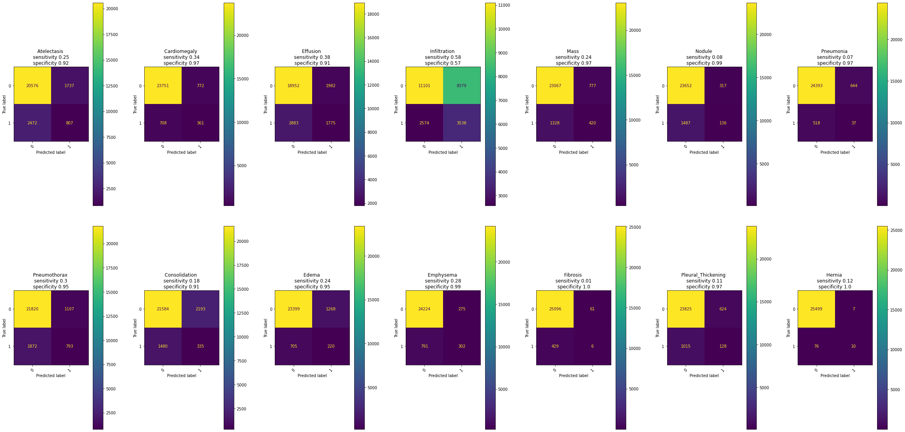
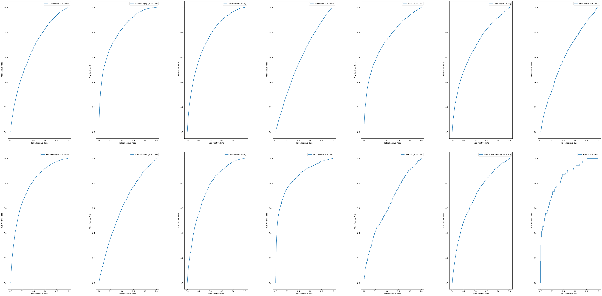
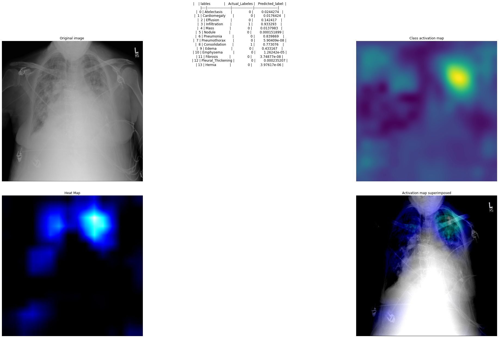

#Reproduce CheXNeXt using Tensorflow

Original paper link : https://journals.plos.org/plosmedicine/article?id=10.1371/journal.pmed.1002686

Dataset provided by :https://nihcc.app.box.com/v/ChestXray-NIHCC?sortColumn=date&sortDirection=ASC

I cite John Zech who achived great results using PyTorch.
While trying to replicate CheXNeXt from the paper his code helped me figure out important things when I encoured problems 
and gave me confidence that even such a hard problem can be done by one person

  author = {Zech, J.},
  title = {reproduce-chexnet},
  year = {2018},
  publisher = {GitHub},
  journal = {GitHub repository},
  howpublished = {\url{https://github.com/jrzech/reproduce-chexnet}}
}

Particular problems faced in the implementation:

We are not told to split the dataset in train and test sets based a percentange but are given a list of training and validation picture names,
this means the clasic flowFromDirectory would not work since it would be a hassle to make code to create 14 subdirectories based on the dataset.
I tried 2 approaches before the final one to load the data :
*Put the pictures as numpy arrays in ndArrays the create a Dataset object from the arrays  --- bad approach as the dataset is too big and we get out of memory error 
*Use ImageDataGenerator with flow_from_dataframe  -- very good for this problem as we can just pass the list of picture names with the directory and it will load them dinamically in batches,
this solved the problem of not wanting to create 14 subdirectories and using flow_from_Directory since we get the same functionality and the memory problem
*Final approach to load the data was tf.data.Dataset.from_tensor_slices((trainingImgages, trainigLabels))  where trainingImgages are the names of the images, 
then calling map to a function that loads the images as tensor based on the image name 

To train the model I used google Colab
I put the code used in googleColabFiles directory 

The algorithm was replicated as in the paper and the results are:

Besides the normal confusion matrix I also print  the sensitivity and specificity

In the AUC Scores I had lower results so far due to not enought training and switching the Cost Function mid way to Focal loss 

I added CAM  + Saliency 

