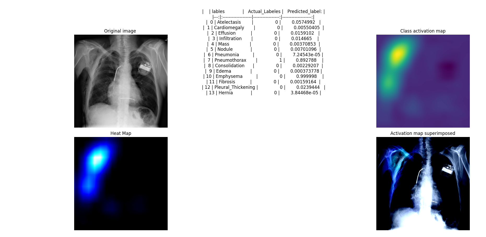

# Reproduce CheXNeXt using Tensorflow

Original paper link : https://journals.plos.org/plosmedicine/article?id=10.1371/journal.pmed.1002686

### Dataset

Dataset provided by :https://nihcc.app.box.com/v/ChestXray-NIHCC?sortColumn=date&sortDirection=ASC

### Citation
I cite John Zech who achived great results using PyTorch.
While trying to replicate CheXNeXt from the paper his code helped me figure out important things when I encoured problems 
and gave me confidence that even such a hard problem can be done by one person

  author = {Zech, J.},
  title = {reproduce-chexnet},
  year = {2018},
  publisher = {GitHub},
  journal = {GitHub repository},
  howpublished = {\url{https://github.com/jrzech/reproduce-chexnet}}
}

Implementation notes:

I replicated the procedure mentioned in the paper:https://journals.plos.org/plosmedicine/article?id=10.1371/journal.pmed.1002686
and used tried different approaches for each step

For augmenting the data:
- Use a  Keras RandomFlip layer in the model to provide a random horizontal flip to help with over-fitting 
- Use tf.image.flip_left_right directly in loading the images in the dataset

For training:
I used different loss functions :
- BinaryCrossEntropy
- FocalLoss
- A customer lossFunction where the positive labels are weighed more since in was noticed that the model even if it gets a good AUC score
when we see the confusion matrix the sensitivity is low per each disease , this function was meant to emphasize to the model the importance of a positive label
since in every disease vector there will be a lot less positives than negatives 

I also tried:

- different batch sizes(8,16) 
- different optimizers(Adam,SGD) with different learning rates

At first, I did not use clas weights and got results close to the paper when it comes to per class AUC,
when using class weights we see that some classes get better AUC while other get worse ones

To train the model I used google Colab
I put the code used in googleColabFiles directory 

I saved the weight after each iteration and use ReduceLearningRate on Plateau using different metrics 

Besides  the normal confusion matrix I also print  the sensitivity and specificity

I also plotted the CAM + Saliency and we compare that to the bounding box provided by the doctors in the dataset(we have 800 images with boudry box to see if the algorithm is detecting in the right place)

Comparative results:
1. my Model model.13-0.8617.h5 
optimizer:Adam , Loss:BCE , ClassWeighs:None

| Pathology | CheXNet |model.13-0.8617.h5|
| ----------- | ----------- |----------- |
| Atelectasis | 0,8094 | 0.774|
| Cardiomegaly | 0,9248 | 0.8772|
| Effusion | 0,8638 | 0.8298|
| Infiltration | 0,7345 | 0.6930|
| Mass | 0,8676 | 0.8305|
| Nodule | 0,7802 | 0.7960|
| Pneumonia | 0,768 | 0.7284|
| Pneumothorax | 0,8887 | 0.8666|
| Consolidation | 0,7901 | 0.7379|
| Edema | 0,8878 | 0.7379 | 0.8466|
| Emphysema | 0,9371 | 0.9355|
| Fibrosis | 0,8047 | 0.8268|
| Pleural Thickening | 0,8062 | 0.7906|
| Hernia | 0,9164 | 0.9253|

### Some Examples

 
2. 8871_bestAUC_BestPrecision
optimizer:Adam , Loss: Custom Loss BCE, Class weighs: yes

| Pathology | CheXNet | 8871_bestAUC_BestPrecision|
| ----------- | ----------- |---------- |
| Atelectasis | 0,8094 | 0,828|
| Cardiomegaly | 0,9248 | 0,890|
| Effusion | 0,8638 | 0,797|
| Infiltration | 0,7345 | 0,910|
| Mass | 0,8676 | 0,887|
| Nodule | 0,7802 | 0,944|
| Pneumonia | 0,768 | 0,754|
| Pneumothorax | 0,8887 | 0,925|
| Consolidation | 0,7901 | 0,642|
| Edema | 0,8878 | 0.737 | 0,860|
| Emphysema | 0,9371 | 0,785|
| Fibrosis | 0,8047 | 0,784|
| Pleural Thickening | 0,8062 | 0,783|
| Hernia | 0,9164 | 0,891|

 
### Some Examples

 

