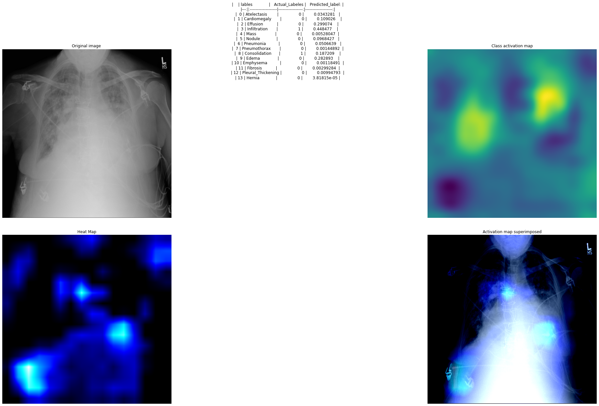

# Reproduce CheXNeXt using Tensorflow

Original paper link : https://journals.plos.org/plosmedicine/article?id=10.1371/journal.pmed.1002686

###Dataset

Dataset provided by :https://nihcc.app.box.com/v/ChestXray-NIHCC?sortColumn=date&sortDirection=ASC

###Citation
I cite John Zech who achived great results using PyTorch.
While trying to replicate CheXNeXt from the paper his code helped me figure out important things when I encoured problems 
and gave me confidence that even such a hard problem can be done by one person

  author = {Zech, J.},
  title = {reproduce-chexnet},
  year = {2018},
  publisher = {GitHub},
  journal = {GitHub repository},
  howpublished = {\url{https://github.com/jrzech/reproduce-chexnet}}
}

Particular problems faced in the implementation:

We are not told to split the dataset in train and test sets based a percentage but are given a list of training and validation picture names,
this means the clasic flowFromDirectory would not work since it would be a hassle to make code to create fourteen subdirectories based on the dataset.
I tried two approaches before the final one to load the data :

1. Put the pictures as numpy arrays in ndArrays then create a Dataset object from the arrays
(bad approach as the dataset is too big, and we get out of memory error)

2. Use ImageDataGenerator with flow_from_dataframe(very good for this problem as we can just pass the list
 of picture names with the directory, and it will load them dynamically in batches
, this solved the problem of not wanting to create 14 subdirectories and using flow_from_Directory 
since we get the same functionality and the memory problem).The dataGenerator has its own built-in function to load the pictures,while debugging I got bad results plotting the image so I did not continue with this approach 

4. Final approach to load the data was tf.data.Dataset.from_tensor_slices((trainingImgages, trainigLabels))  
where trainingImgages are the names of the images, then calling map to a function that loads the images as tensor based on the image name 
A Keras RandomFlip layer was used to provide a random horizontal flip to help with over-fitting 

To train the model I used google Colab
I put the code used in googleColabFiles directory 

The algorithm was replicated as in the paper at first,
I tried 
- different batch sizes(8,16) 
- different optimizers(Adam,SGD) with different learning rates
- different loss functions(Binary Cross Entropy , Binary focal loss from keras, a function found on the internet for focal loss)

I saved the weight after each iteration and use ReduceLearningRate on Plateau using different metrics 

If I were to do the problem again I would make 4 models, 2 with FocalLoss 2 with BinaryCrossEntropy each of these with either SGD or ADAM as the optimizer,
And with these 4 models try different HyperParameters, For Adam Batch size and Learning rate are very important from the results I saw

Besides, the normal confusion matrix I also print  the sensitivity and specificity

| Pathology | CheXNet | my Model model.13-0.8617.h5|
| ----------- | ----------- |----------- |
| Atelectasis | 0,8094 | 0.774|
| Cardiomegaly | 0,9248 | 0.8772|
| Effusion | 0,8638 | 0.8298|
| Infiltration | 0,7345 | 0.6930|
| Mass | 0,8676 | 0.8305|
| Nodule | 0,7802 | 0.7960|
| Pneumonia | 0,768 | 0.7284|
| Pneumothorax | 0,8887 | 0.8666|
| Consolidation | 0,7901 | 0.7379|
| Edema | 0,8878 | 0.7379 | 0.8466|
| Emphysema | 0,9371 | 0.9355|
| Fibrosis | 0,8047 | 0.8268|
| Pleural Thickening | 0,8062 | 0.7906|
| Hernia | 0,9164 | 0.9253|

In the AUC Scores I had lower results so far,not as good as CheXNet or as John Zech
This leads me to believe the RandomFlip needs to be improved to offer a 50 % chance of inversion like in the paper and more searching in the hyperparameter space has to be performed

###Some Examples
I added CAM  + Saliency 

